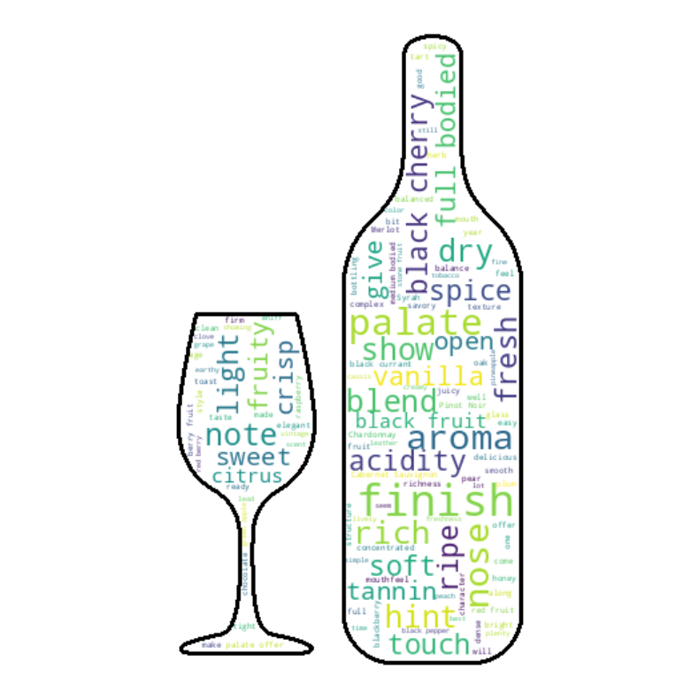

# Sip & Script: A Data-Driven Journey Through the World of Wine

I ran an exploratory data analysis utilizing a Wine Review dataset from Kaggle, which contained roughly 130k Wine Enthusiast reviews. I took this project as an opportunity to analyse the data and explain my results through a [medium blog](https://medium.com/@aghoshpro/sip-script-a-data-driven-journey-through-the-world-of-wine-d9d05d6dcf4e) post that provides insight into the questions posed.

## WordCloud

