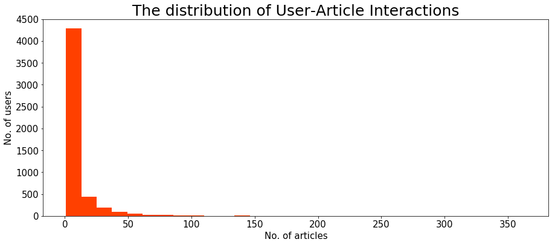
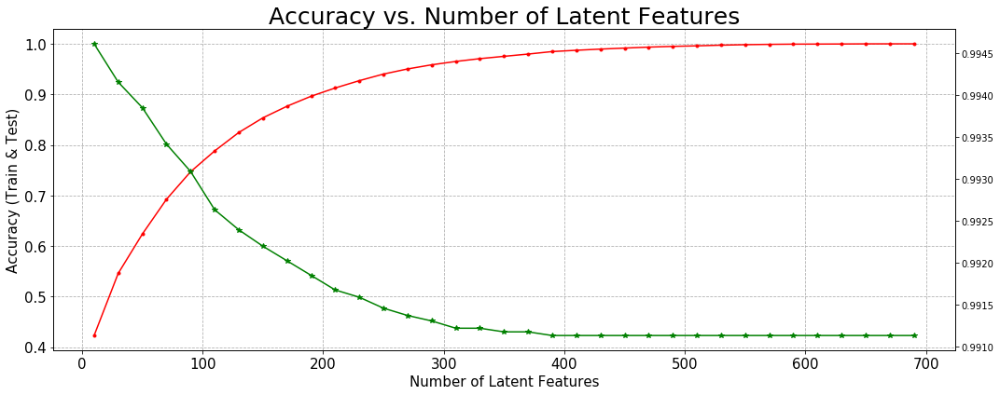

# Project 3 - Recommendations With IBM

## Project Overview

This project will involve analysing user interactions with articles on the IBM Watson Studio platform and providing recommendations for new topics that may interest them. The following is an illustration of a potential dashboard showcasing articles on the IBM Watson Platform. While the aforementioned dashboard displays only the latest items, one may see the inclusion of a recommendation board that highlights content most relevant to an individual user. To ascertain which articles to present to each user, we will do an analysis of the data accessible on the IBM Watson Studio platform. You may establish your own account to join their community and gain a deeper insight into their data by registering on the platform here.


## Data (from IBM)

```
articles_community.csv
user-item-interactions.csv
```



## Essential libraries

You need python3 and the following libraries installed to run the project:

- pandas
- numpy
- matplotlib
- pickle

## Project Execution

### I. Exploratory Data Analysis

Prior to formulating any recommendations, it is essential to analyse the data pertinent to the project. Explore to discover what is available. Essential, mandatory enquiries must be addressed regarding the data you are utilising throughout the remainder of the notebook. Utilise this area for exploration prior to delving into the specifics of your recommendation system in subsequent sections.

### II. Rank Based Recommendations

To initiate the development of suggestions, you will first identify the most popular articles based solely on the highest level of interactions. In the absence of ratings for the articles, one may readily infer that those with the highest interactions are the most favoured. These are the articles we may suggest to new users or others based on our knowledge of them.

### III. User-User Based Collaborative Filtering

To enhance recommendations for customers of IBM's platform, we should analyse users with comparable interactions about products. These things could subsequently be suggested to analogous users. This would represent progress towards enhanced personalised recommendations for users. This will be your subsequent implementation.

### IV. Content Based Recommendations (Optional)

Considering the volume of content associated with each article, various methods exist for implementing a content-based recommendation system. Employing your NLP expertise, you may devise innovative methods to create a content-based recommendation system. While the development of a content-based recommendation system is suggested, it is not mandatory for the completion of this project.

### V. Matrix Factorization

Ultimately, you will finalise a machine learning methodology for generating suggestions. Utilising the user-item interactions, you will construct a matrix decomposition. Your decomposition will provide insight into the accuracy of predicting the articles an individual may engage with (spoiler alert - it is suboptimal). You will ultimately examine the approaches you may employ going ahead and how you could evaluate the effectiveness of your recommendations in engaging people.

## Final Output



The accuracy of the test data diminishes with an increase in latent characteristics, whereas the accuracy of the training data improves. The number of latent features should be maintained relatively minimal because this is most likely the result of the data becoming overfitted as latent features increase. It's crucial to remember that when we apply SVD in this case, we can only really propose the 20 users in the training and test datasets. Additionally, our matrix is extremely sparse, which is probably why the test data accuracy is so high at >99%. If more people were included in both the test and training data, it would be intriguing to examine the outcomes. This would be a nice number of latent features to include since, as we can see, there is a cross over point at about 80 features where the accuracy for test data starts to decline. Beyond that, our accuracy for training grows but testing declines. To address the cold start issue, we may run an A/B test for new users to see how well our recommendation engine performs in real-world scenarios. For instance, we might utilise our recommendation engine to suggest articles to one set of users and then only suggest the most popular items to the other group. To determine whether our recommendation engine increases clicks, we would then compare the click-through rates. We may determine that this is effective and need to be implemented if we observed a notable increase in clicks when utilising our recommendation engine

## Acknowledgements

Thanks Udacity for the starter code, data, the project inspiration.
