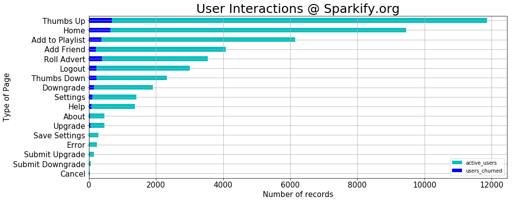
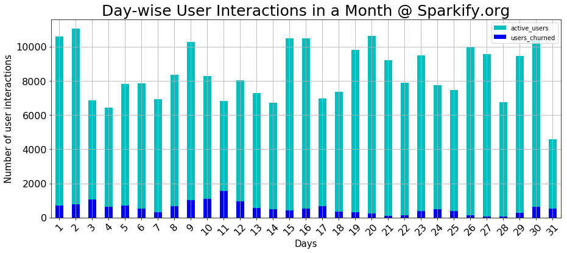
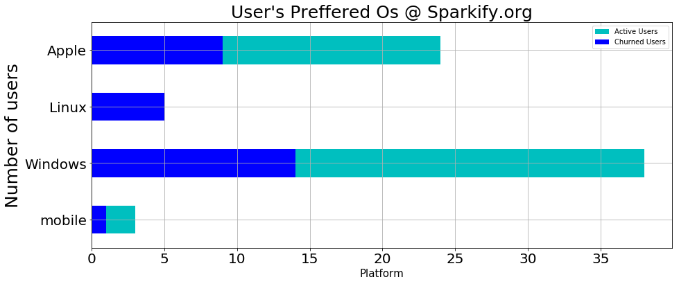
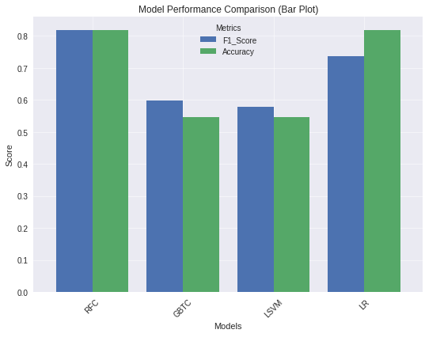
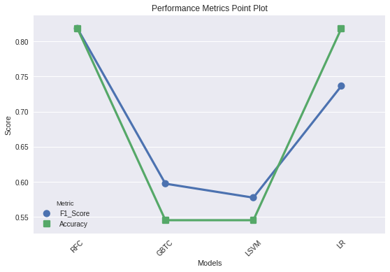
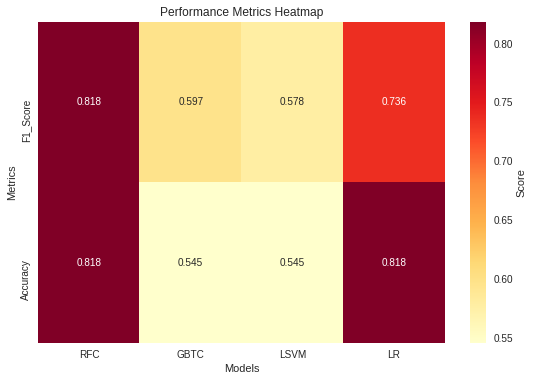

# Capstone Project - Detection of User Churn @ Sparkify.org

## Project Motivation

Forecasting `churn` or attrition rates presents a complex and prevalent challenge that data scientists and analysts frequently face in customer-oriented enterprises. The capacity to adeptly handle extensive datasets using Spark is among the most sought-after competencies in the data domain. Also to convey the findings of the project to company shareholder in a manner so they can understand.

## Project Overview

**Sparkify.org** (similar to Spotify) under Udacity provides audiophiles with loads of different music streaming service. Many people stream their favourite songs to our service every day, either free-mium level or the premium membership model. Users may upgrade, downgrade, or terminate their subscription at any time. So, it is critical to ensure that users enjoy the service. Every interaction a user has with the service, such as playing songs, logging out, giving a song a thumbs up, hearing an ad, or downgrading their account, creates data. All of this data includes valuable insights for keeping people satisfied and Sparkify's business thriving. It is our role on the data team to estimate which subscribers are likely to churn, either by downgrading from premium to free tier or quitting their account entirely. If we can correctly identify these users before they leave, Sparkify can offer them discounts and incentives, possibly saving the company millions of dollars worth revenue.

Sparkify keeps a log file with 18 fields for each user interaction (for example, userId, song name, song length, and artist name). The log file's data volume exceeded the available memory space on normal desktop computers, prompting the organisation to use the distributed file system Apache Spark™ instead.

## Project Approaches

- Check the data [Original data = 12 GB but small dataset (_mini_sparkify_event_data.json_) = 126 MB]
- Load data into Spark
- Exploratory Data Analysis (EDA)
- Data Wrangling
- Create Features
- Train/test data split
- Build Model Pipeline
- Predict Churn
- Metric Viz (Accuracy and F1)

In this project, we utilise Spark SQL and Spark Dataframes to evaluate a subset of the user data from Sparkify's Log file. We use PySpark's Machine Learning Library ([MLlib](https://spark.apache.org/docs/latest/ml-guide.html)) to anticipate Sparkify user churn. After reviewing a subset of the Log file, we discovered 37 features in the user data that can aid in detecting impending churn. To train ML models, we generate a list of characteristics for each user in the subset. We next assess the performance of four MLlib classification models for churn prediction.

We select our winning model, a tweaked version of the Logistic Regression model. Because churned users are a small group, we use F1 score as the metric for optimisation. We employ cross-validation to make better use of available data and to learn more about the algorithm's performance.

## Results

- ### User Interaction @ Sparkify.org
  
- ### Day wise User Interactions in a Month @ Sparkify.org
  
- ### Different Operating System used by users @ Sparkify.org
  

## Medium Blog

Check out my [myBlogpost](https://medium.com/@aghoshpro/beat-the-churn-how-were-using-pyspark-ml-to-keep-the-music-streaming-2b202dca6aaa) to understand the project in detail.

## Conclusion and Visualization

The winning model for churn prediction are

- Logistic Regression Model
- Random Forest Classifier (\* need to check)

One can also check the visuals below indicating the above truth

