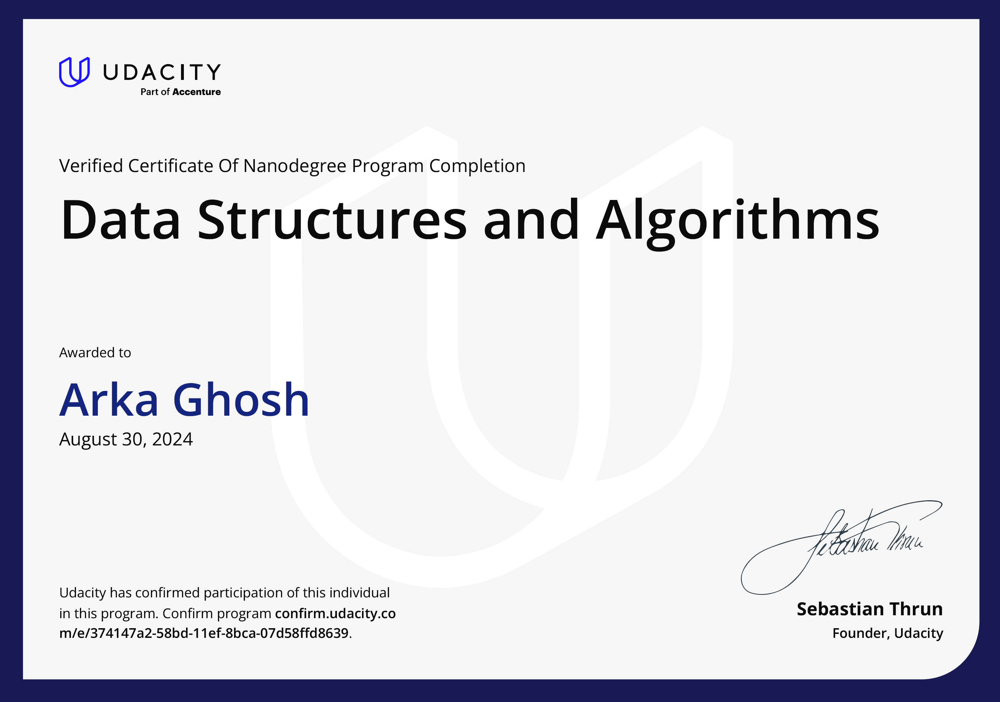

# Data Structures & Algorithms Nanodegree

This repository contains all my solutions to the tutorials and projects of the [Udacity Data Structures & Algorithms Nanodegree Course](https://www.udacity.com/course/data-structures-and-algorithms-nanodegree--nd256). This course helped me refresh my grasp of data structures and algorithms by requiring me to solve over 80+ practice questions. I start each course by learning how to tackle defined issues with a specific data structure and technique. At the end of each course, I would be able to analyse and compare various data structures and algorithms for any open-ended challenge, as well as create a solution based on my design decisions.

## Certificate

[](https://www.udacity.com/certificate/e/374147a2-58bd-11ef-8bca-07d58ffd8639)

## Course 1: Introduction

Get an overview of your program. Meet your instructors, and refresh your python skills. Learn the framework to
deconstruct any open-ended problem and then understand the concepts of time and space complexity, essential tools
for evaluating different data structure & algorithms.

- Lesson 1: Introduction
- Lesson 2: Python Refresher
- Lesson 3: How to Solve Problems
- Lesson 4: Big O Notation

```
Project 1: Unscramble Computer Science Problems
Deconstruct a series of open-ended problems into smaller components (e.g, inputs, outputs, series of functions).
```

## Course 2: Data Structures

Learn different data structures that can be used to store data. Implement different methods used to manipulate these
data structures and examine the efficiency. Understand the advantages and applications of different data structures.
Learn how to approach open ended problems (either in interviews or in real-world scenarios) and select appropriate
data structures based on requirements.

- Lesson 1: Collection data structures (lists, arrays, linked lists, queues, stack)
- Lesson 2: Recursion
- Lesson 3: Trees
- Lesson 4: Maps and Hashing

_Sample Practice Problems: Reverse Strings, Hamming Distance, Reverse a Linked List, Linked List Loop Detection,_
_Balancing Brackets, Building Queue using Stacks, Tree Traversals, Checking Binary Search Tree, String Key Hash_
_table_

```
Project 2: Show Me the Data Structures
Solve a series of open-ended practice problems such as LRU Cache, Private Blockchain, File Recursion and
many more. Hone your skills to identify and implement appropriate data structures and corresponding methods
which meet given constraints.
```

## Course 3: Basic Algorithms

Learn and implement basic algorithms such as searching and sorting on different data structures and examine the
efficiency of these algorithms. Use recursion to implement these algorithms and then learn how some of these
algorithms can be implemented without recursion. Practice selecting and modifying these algorithms for a variety of
interview problems.

- Lesson 1: Binary Search
- Lesson 2: Sorting Algorithms
- Lesson 3: Divide & Conquer Algorithms

_Sample Practice Problems: Randomized Binary Search, K-smallest elements using Heaps, Build Red-Black Tree,_
_bubble sort, merge sort, quick sort, sorting strings, Linear-time median finding_

```
Project 3: ​ Problems vs. Algorithms
A series of real-world open ended problems such as request routing for web server, search-term auto-completion
and Fibonacci heap which train you to apply suitable data structures and algorithms under different context.
```

## Course 4: Advanced Algorithms

Build on your algorithm skills by learning more advanced algorithms such as brute-force greedy algorithms, graph
algorithms, and dynamic programming, which optimizes recursion by storing results to sub problems.

- Lesson 1: Greedy Algorithms
- Lesson 2: Graph Algorithms
- Lesson 3: Dynamic Programming
- Lesson 4: Linear Programming

_Sample Practice Problems: Graph Traversals, Dijkstra's Algorithm, Shortest Hops, A Search, Longest Palindromic, subsequence, web crawler_

```
Project 4: ​ Route Planner
In this project, you will build a route-planning algorithm like the one used in Google Maps to calculate the shortest
path between two points on a map. You will first select and implement appropriate data-structure to represent
points on a map and then implement the A* algorithm to find shortest path.
```
