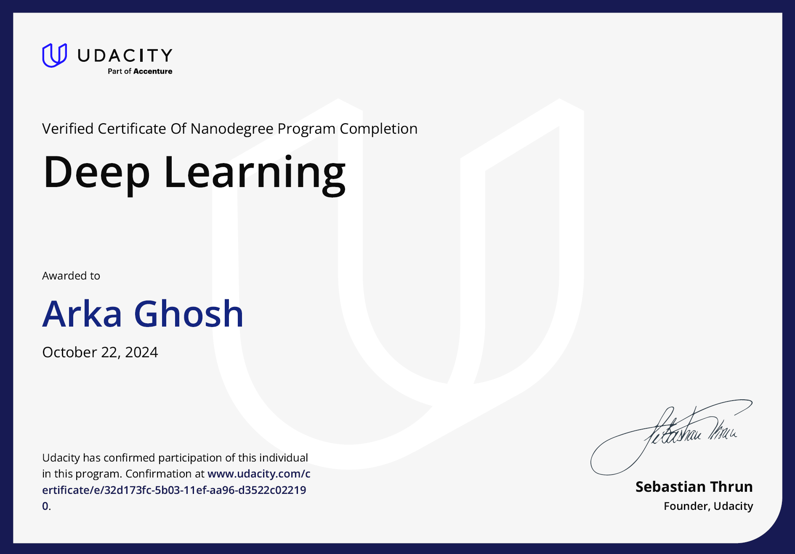

# Deep Learning Nanodegree

This repository contains all my solutions to the tutorials and projects of the [Udacity Deep Learning Nanodegree Course](https://www.udacity.com/course/deep-learning-nanodegree--nd101). This course helped me refresh my grasp of important deep learning concepts such as ...

## Certificate

## Projects

1. [Part of Speech (POS) Tagging with Hidden Markov Models (HMMs)](<https://github.com/aghoshpro/Upskill-Myself/tree/main/Natural%20Language%20Processing%20(NLP)-NanoDegree/P3.%20Project%20HMM%20Tagger>)

2. [Machine Translation](<https://github.com/aghoshpro/Upskill-Myself/tree/main/Natural%20Language%20Processing%20(NLP)-NanoDegree/P9.%20Machine%20Translation>)

3. [Speech Recognition with Deep Neural Networks (DNNs)](<https://github.com/aghoshpro/Upskill-Myself/tree/main/Natural%20Language%20Processing%20(NLP)-NanoDegree/P10.%20Speech%20Recognition%20with%20DNN>)
