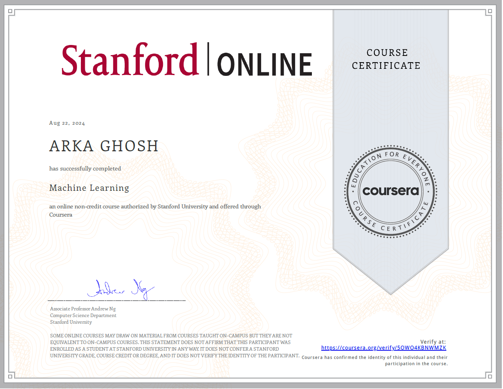

# Machine Learning by Stanford University (Coursera)

This repository contains all the course programming assignments, quizzes, and lecture materials [Machine Learning by Stanford University](https://www.coursera.org/learn/machine-learning/) taught by Andrew Ng on Coursera.

<!-- ## Take Away

After completion, I gained an intermediate idea of some common machine learning algorithms and how they work. -->

## Certificate

<!-- ## Contents

- [Assignments](https://github.com/SHANK885/Machine-Learning-Andrew-Ng/tree/master/Assignments)
- [Lectures](https://github.com/SHANK885/Machine-Learning-Andrew-Ng/tree/master/Lectures)
- [Quizzes](https://github.com/SHANK885/Machine-Learning-Andrew-Ng/tree/master/Quizzes) -->

## Projects

> [Ex - 1](https://github.com/aghoshpro/Upskill-Myself/tree/main/Machine%20Learning/Projects/machine-learning-ex1) : _Implementing and visualizing linear regression using gradient descent as optimizer. (Accuracy)_

> [EX - 2](https://github.com/aghoshpro/Upskill-Myself/tree/main/Machine%20Learning/Projects/machine-learning-ex2) : _Implementing and visualizing logistic regression using fminfunc as optimizer. (Accuracy: 89%)_

> [EX - 3](https://github.com/aghoshpro/Upskill-Myself/tree/main/Machine%20Learning/Projects/machine-learning-ex3) : _Implementing One vs All logistic regression._

> [EX - 4](https://github.com/aghoshpro/Upskill-Myself/tree/main/Machine%20Learning/Projects/machine-learning-ex4) : _Implementing a neural net with some pre trained weights._

> [EX - 5](https://github.com/aghoshpro/Upskill-Myself/tree/main/Machine%20Learning/Projects/machine-learning-ex5) : _Learning and tuning hyperparameters._

> [EX - 6](https://github.com/aghoshpro/Upskill-Myself/tree/main/Machine%20Learning/Projects/machine-learning-ex6) : _Implementing an linear6SVM._

> [EX - 7](https://github.com/aghoshpro/Upskill-Myself/tree/main/Machine%20Learning/Projects/machine-learning-ex7) : _Implementing a basic K-Means Clustering algorithm._

> [EX - 8](https://github.com/aghoshpro/Upskill-Myself/tree/main/Machine%20Learning/Projects/machine-learning-ex8) : _Learning and visualizing testing parameters for a model._

## Lectures

- [Lecture 1](https://github.com/aghoshpro/Upskill-Myself/blob/main/Machine%20Learning/Lectures/Lecture1.pdf)
- [Lecture 2](https://github.com/aghoshpro/Upskill-Myself/blob/main/Machine%20Learning/Lectures/Lecture2.pdf)
- [Lecture 3](https://github.com/aghoshpro/Upskill-Myself/blob/main/Machine%20Learning/Lectures/Lecture3.pdf)
- [Lecture 4](https://github.com/aghoshpro/Upskill-Myself/blob/main/Machine%20Learning/Lectures/Lecture4.pdf)
- [Lecture 5](https://github.com/aghoshpro/Upskill-Myself/blob/main/Machine%20Learning/Lectures/Lecture5.pdf)
- [Lecture 6](https://github.com/aghoshpro/Upskill-Myself/blob/main/Machine%20Learning/Lectures/Lecture6.pdf)
- [Lecture 7](https://github.com/aghoshpro/Upskill-Myself/blob/main/Machine%20Learning/Lectures/Lecture7.pdf)
- [Lecture 8](https://github.com/aghoshpro/Upskill-Myself/blob/main/Machine%20Learning/Lectures/Lecture8.pdf)
- [Lecture 9](https://github.com/aghoshpro/Upskill-Myself/blob/main/Machine%20Learning/Lectures/Lecture9.pdf)
- [Lecture 10](https://github.com/aghoshpro/Upskill-Myself/blob/main/Machine%20Learning/Lectures/Lecture10.pdf)
- [Lecture 11](https://github.com/aghoshpro/Upskill-Myself/blob/main/Machine%20Learning/Lectures/Lecture11.pdf)
- [Lecture 12](https://github.com/aghoshpro/Upskill-Myself/blob/main/Machine%20Learning/Lectures/Lecture12.pdf)
- [Lecture 13](https://github.com/aghoshpro/Upskill-Myself/blob/main/Machine%20Learning/Lectures/Lecture13.pdf)
- [Lecture 14](https://github.com/aghoshpro/Upskill-Myself/blob/main/Machine%20Learning/Lectures/Lecture14.pdf)
- [Lecture 15](https://github.com/aghoshpro/Upskill-Myself/blob/main/Machine%20Learning/Lectures/Lecture15.pdf)
- [Lecture 16](https://github.com/aghoshpro/Upskill-Myself/blob/main/Machine%20Learning/Lectures/Lecture16.pdf)
- [Lecture 17](https://github.com/aghoshpro/Upskill-Myself/blob/main/Machine%20Learning/Lectures/Lecture17.pdf)
- [Lecture 18](https://github.com/aghoshpro/Upskill-Myself/blob/main/Machine%20Learning/Lectures/Lecture18.pdf)

## Quizzes

- [Week 1](https://github.com/aghoshpro/Upskill-Myself/tree/main/Machine%20Learning/Quizzes/Week%201)
- [Week 2](https://github.com/aghoshpro/Upskill-Myself/tree/main/Machine%20Learning/Quizzes/Week%202)
- [Week 3](https://github.com/aghoshpro/Upskill-Myself/tree/main/Machine%20Learning/Quizzes/Week%203)
- [Week 4](https://github.com/aghoshpro/Upskill-Myself/tree/main/Machine%20Learning/Quizzes/Week%204)
- [Week 5](https://github.com/aghoshpro/Upskill-Myself/tree/main/Machine%20Learning/Quizzes/Week%205)
- [Week 6](https://github.com/aghoshpro/Upskill-Myself/tree/main/Machine%20Learning/Quizzes/Week%206)
- [Week 7](https://github.com/aghoshpro/Upskill-Myself/tree/main/Machine%20Learning/Quizzes/Week%207)
- [Week 8](https://github.com/aghoshpro/Upskill-Myself/tree/main/Machine%20Learning/Quizzes/Week%208)
- [Week 9](https://github.com/aghoshpro/Upskill-Myself/tree/main/Machine%20Learning/Quizzes/Week%209)
- [Week 10](https://github.com/aghoshpro/Upskill-Myself/tree/main/Machine%20Learning/Quizzes/Week%2010)
- [Week 11](https://github.com/aghoshpro/Upskill-Myself/tree/main/Machine%20Learning/Quizzes/Week%2011)
