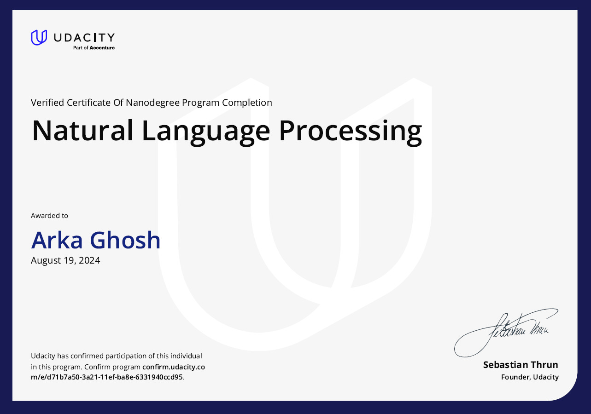

# Natural Language Processing (NLP)

This repository contains all the basic practices in NLP and my solutions to the tutorials and projects of the [Udacity NLP Nanodegree Course](https://www.udacity.com/course/natural-language-processing-nanodegree--nd892). I used the provided and pre-configured workspaces of Udacity for all the tutorials and projects.

## Certificate

## Project 1 : Part of Speech (POS) Tagging

Part of speech tagging is the process of determining the syntactic category of a word from the words in its surrounding context. It is often used to help disambiguate natural language phrases because it can be done quickly with high accuracy. Tagging can be used for many NLP tasks like determining correct pronunciation during speech synthesis (for example, _dis_-count as a noun vs dis-_count_ as a verb), for information retrieval, and for word sense disambiguation.

- [Check out the project page](<https://github.com/aghoshpro/myProjects/tree/main/Natural%20Language%20Processing%20(NLP)/Project%2001%20-%20HMM%20Tagger#introduction>)

## Project 2 : Sentiment Analysis

Sentiment analysis, often known as opinion mining, is a natural language processing (NLP) technique that identifies and extracts sentiments or opinions from text data. The basic goal of sentiment analysis is to understand the sentiment conveyed in a text, whether good, negative, or neutral.

- [Check out the project page](<https://github.com/aghoshpro/myProjects/tree/main/Natural%20Language%20Processing%20(NLP)/Project%2002%20-%20Sentiment%20Analysis#personality-determination-based-on-sentiment-analysis>)

## Project 3 : Machine Translation

Machine translation is the technique of employing artificial intelligence to mechanically translate text from one language to another with no human intervention. Modern machine translation goes beyond simple word-by-word translation to convey the entire sense of the original language text in the target language. It examines all text parts and recognises how words affect one another.

- [Check out the project page](<https://github.com/aghoshpro/myProjects/tree/main/Natural%20Language%20Processing%20(NLP)/Project%2003%20-%20Machine%20Translation#introduction>)

## Project 4 : Speech Recognition with Deep Neural Networks (DNNs)

Speech recognition is a machine or program's capacity to recognise and interpret human speech. It has a wide range of applications, including virtual assistants like Siri and Alexa, as well as audio track transcription, such as creating subtitles for YouTube videos. Early voice recognition systems used hand-crafted algorithms and acoustic models. However, with the advent of deep learning, speech recognition systems have gotten significantly more accurate. Deep neural networks can learn voice representations directly from data, outperforming earlier state-of-the art models.

- [Check out the project page](<https://github.com/aghoshpro/myProjects/tree/main/Natural%20Language%20Processing%20(NLP)/Project%2004%20-%20Speech%20Recognition%20with%20DNN>)

- TensorFlow Speech Recognition Tutorial
- Kaldi Speech Recognition Toolkit: http://kaldi-asr.org/
